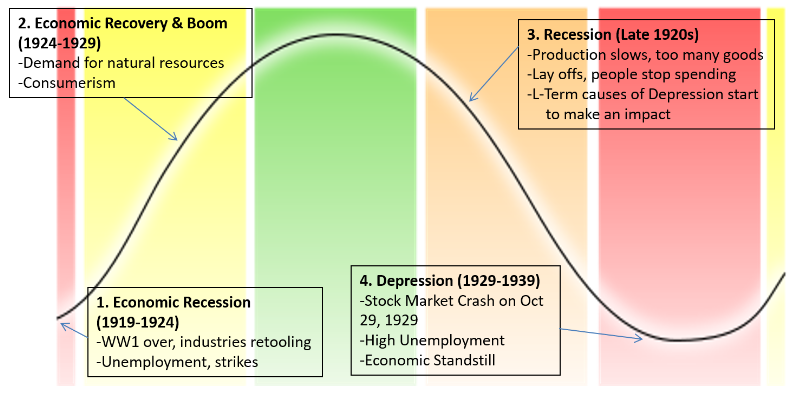

## Business Cycle
| Cycle             | Description                                                                                                     |
| ----------------- | --------------------------------------------------------------------------------------------------------------- |
| Peak              | Wages are high, Unemployment is low, Prices & Production is high, People are willing to take business risks     |
| Recession         | Economic activity declines, Demand for goods & services is low, Unemployment & Business failures increase       |
| Trough/Depression | Low point for the economy. Most cycles and recessions don't become depressions but will instead become a trough |
| Recovery          | Eventual improvment of the economy, business hire more workers, demand increases.                                                                                                                |

## Black Tuesday
**Black Tuesday** (October 29, 1929) refers to the drop in value of the Dow Jones Industrial Average. It's commonly marked as the beginning of the **great depression**. It was a short term cause of the great depression.

## Long Term Causes Of The Great Depression
| Cause                                    | Explanation                                                                                                                                                                                        |
| ---------------------------------------- | -------------------------------------------------------------------------------------------------------------------------------------------------------------------------------------------------- |
| Businesses Over-expanding                | During the 1920s, companies rapidly expanded. However, they expanded too quickly and when demand slowed, many of these expansions shut down.                                                       |
| Canada's Dependence On Natural Resources | Canada's exports were natural resources and its economy depended on it as a result. When the prices of these resources dropped, Canada would be hit hard as there weren't any other major imports. |
| Canada's Dependence On The US            | 40% of Canada's exports went to the US. 60% of imports were from the US. This linked Canada's economy to the US economy.                                                                           |
| Excessive Use Of Credit                  | Many people bought on credit during the 1920s. Many were lured in by the "buy now, pay later" advertising and lived beyond their means.                                                            |
| Gambling On The Stock Market             | Many saw the stock market as a way to get rich quick during the 1920s. They would invest money they could not afford to lose. This made Black Tuesday devastating to investors.                                                                                                                                                                                                   |

## Life During The Great Depression

- The depression grew steadily worse during the 30s. 
- Canada's overall public & private spending fell by 42%. 
- By 1933, 30% of the labour force was out of work.
- 1 in 5 Canadians became dependent upon government relief in order to survive.

### Dust Bowl In The Prairies

- Grass had been replaced for friends.
- Crop prices (their main export) dropped substantially.
- A drought hit the Prairies making growing crops difficult.
- Farmers would not plant many crops and without any grass or crops to hold rainfail, the soil became extremely dry.
- High winds would pick up dry soil creating dust storms. The worst ones were deadly.

### Food Shortage

- The unemployed went hungry
- Soup kitchens were set up by private organizations and people would line up in commonly long lines.
- Discriminated groups (eg. African Americans, Asian Americans, etc) were hit especially hard.

### Eviction & Squatters

- Some families/individuals could not afford rent or their mortgages.
- Some were embarrassed and would begin squatting in their own homes.
- Landlords/Banks would get the court to issue an eviction notice.
- Baliffs would then eject these squatters and their belongings.

### Nomads/Homeless
- Some would try to find work/a better life by hitchhiking or **"riding the rails"** (hitching a free ride on a freight train.).
- Some families who lost their homes but still had their cars would live in their cars.

### Bennett's Popularity

- Many Canadians blamed the government for the lack of support & answers.
- They would name things after the PM R.B. Bennett out of hate.
| Named Items      | Explanation                                                 |
| ---------------- | ----------------------------------------------------------- |
| Bennett Buggy    | A horse-drawn car used when the owner couldn't pay for gas. |
| Bennett Blankets | Newspapers used by the homeless to keep warm.               |
| Bennettvilles    | Communities of homeless people on public lands. Aka Shantytowns.                                                            |

### Income Inequality

Some rich individuals were not affect or simply had to scale down their lifestyles. The depression emphasized the divide between the rich and poor and the wealth inequality in Canada.

### Entertainment

Many saw entertainment as a way to escape their miserable lives.

#### Movies
During the 1930s, over 60 million Americans went to the movies per week.
Some notable films & individuals include:
- Snow White
- King Kong
- The Wizard of Oz
- Hattie McDaniel - The first African American to win an Academy Averd
- Shirley Temple - A child star linked to the Depression

#### Radio

Radios offered information and entertainment directly into the home. Entertainment ranged from dramas to comedies to adventures.

#### Literature & Art

Artists attempted to portray life around them. Written words were a powerful method. However, photos emerged. Photographers travelled the nation with new 35mm cameras.

## Politics

### First PM - Mackenzie King
Mackenzie King was the new Liberal Leader in 1919. He became Canada's longest serving PM and was in power from 1921-1945 (except 1926 & 1930-35). He was pro **laissez faire** & was infamous for his **"5 cent speech"** where he claimed he would not give even 5 cents to provinces. This made him unpopular and he lost the vote to R.B. Bennet in the **1930** election.