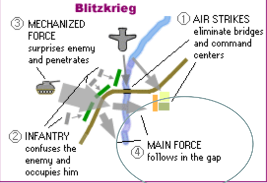

## Main Causes

Remember the Acronym **FART**

| Letter | Cause                            |
| ------ | -------------------------------- |
| F      | Failure of the League Of Nations |
| A      | Appeasement                      |
| R      | Rise of Fascism & Dictatorships  |
| T      | Treaty Of Versailles                                 |

### Failure of the League Of Nations

The **League Of Nations** was an international organization created after WW1 with the goal of providing a place to settle conflicts peacefully. This would hopefully discourage aggression. avoid future wars & encourage international cooperation.

#### Why did it fail?

**Not All Countries Joined**
- Less than 50% of the world joined the League Of Nations.
- The USA did not join & the Soviet Union was excluded which meant the League Of Nations did not have the support of 2 of the world's superpowers at the time.

**No Power**
- Most common form of retaliation were sanctions.
- Could not do much towards aggressive countries.

**No Army**
- No army.
- Countries were not required to provide an army.

**Unable To Act Quickly**
- Needed to reach a consensus before acting
- Recommendations were not binding

#### Biggest Fn ailures

The LoN failed to deal with:

| Country | Failures                                   |
| ------- | ------------------------------------------ |
| Italy   | Mussolini's invasion of Ethiopia & Albania |
| Japan   | Hirohito's invasion of Manchuria, China    |
| Germany | Germany re-arming the military             |
| Germany | Announcing conscription                    |
| Germany | Entering the Rhineland (Neutral Territory) |
| Germany | Reuniting with Austria                     |
| Germany | Invading Czechoslovakia                                           |

All 3 countries defied the LoN without any repercussions.

### Appeasement

**Appeasement** - Giving people what they want to avoid conflict.

Appeasement allowed aggressive nations to expand without any resistance.

Here's examples by Germany:

| Actions Taken By Germany             | Why Appeasement?                                       |
| ------------------------------------ | ------------------------------------------------------ |
| 1933-35 Re-armed & conscription      | Germany had a right to re-arm to protect their country |
| 1936 Entered & claimed the Rhineland | The area belonged to Germany until after WW1           |
| 1938-39                              | German speakers in Czechoslovakia were being "oppressed" and should be reunited with Germany                                                       |

#### Munich Pact
Hitler wanted to unite Germany and a region in Czechoslovakia (Sudentenland). He threatened to unlease war.

The **Munich Pact** was signed between Britain, France & Germany where Germany would be given the Sudentenland. In exchange, Hitler agreed it would be his last demand & he would not declare war. Shortly after, the entirety of Czechoslovakia was under German control. 

### Rise Of Fascism & Dictatorships

**Dictator** - Leaders who achieved **absolute power** in their countries.

**Absolute Power** - Total control & use the police, fear, military, & terror to get what they want.

**Fascism**
- Is lead by a dictator
- Creates a militaristic society that uses the army & police to maintain order or limit freedoms
- Promotes extreme nationalism
- Based on racism. Citizens need to be of a certain ethnic group or be labelled enemies of the state.

Fascism was a term created by Benito Mussolini in Italy in 1919.

Symbol of Fascism:

Uses symbol of **STICKS** to represent **CORPORAL** punishment.

Uses symbol of an **AXE** to represent **CAPITAL** punishment.

Together, they represented authority and power (of the empire)

### Treaty Of Versailles

The **Treaty Of Versailles** were the peace terms of WW1. It's terms were created to weaken Germany to ensure they would never wage war again. Harsh terms include the "war guilt clause", demilitarization, & reparations. Many Germans felt angry, fueled by extreme nationalism, had a distrust of other nations, & many wanted revenge.

## Mein Kempf

Adolph Hitler before becoming the fuhrer wrote a manifesto called Mein Kempf (translated to My Struggle). His manifesto criticized the **Treaty of Versailles** & described his ideas how he would restore honour to the German people.

He believed that all Germans needed to be united under 1 leader, the Treaty of Versailles broken, Jewish & Communists were eliminated, and the German people regained respect & were given what they needed & deserved from the international community.

## Nazi Expansion: 1939-1940

### Short Term Cause Of WW2

Britain & France finally drew the line with Poland. They told Hitler that should he invade, they would declare war.

Hitler didn't care and invaded Poland without a declaration of war on Sept 1, 1939.

Within 2 days, Britain & France declared war.

Canada declared war a week later on Sept 10, 1939.

### Germany's Military Advantage

Germany had been preparing & re-arming for 6 years.

Their equipment was more up-to-date

### Blitzkrieg

Germany developed a new military tactic called **Blitzkrieg** (translated to lightning war). It utilized Germany's new tanks & airplanes to launch quick, surprise attacks against the enemy.

It had 4 stages:

#### Air Strikes

Key areas were bombed from the air by the **Luftwaffe**. These included roads, bridges, & command posts.

#### Infantry

Troops were placed in a long line in order to keep the enemy occupied & confused.

#### Mechanized Force

Using the element of surpirse, **panzers** attacted enemies where they least expected.

#### The Main Force

The troops from phase 2 would encircle the enemy as more troops would attack the enemy from behind by gliding over them with prachutes or gliders.

### Polish Invasion

The Germans used the Blitzkrieg tactic. The Polish attempted to fight back but was outclassed by newer, superior equipment. In less than a month, the Germans defeated over 700,000 Polish soldiers & only sustained 14,000 deaths.

### Sitzkrieg (Phoney War)

After Poland was defeated, the German army was sent to protect it's borders through the winter of **1939-1940**. No new attacks were launched.

The Allies declared war but did not take any action. The Fr_nch had a defensive stragey but no offensive strategies. 

This winter break was called Sitzkrieg or the "Phoney War".

### The Maginot Line & The Battle Of Fr_nce

The Fr_nch had build a developed chain of ground-level fortifications along the border with Germany. It was meant to bring "high-tech" advancements to the trench warfare taactics of WW1.

However, Germany pulled a pro gamer move and attacked Fr_nce through Belgium in the spring of 1940. In 10 days, the Germans defeated the Fr_nch and the allies had to retreat to Dunkirk.

Military Stats:

| Germany               | Fr_nce                 |
| --------------------- | ---------------------- |
| 135 Army Divisions    | 104 Army Divisions     |
| 4500 Aircraft         | 2100 Aircraft          |
| 7500 Artillery Pieces | 10000 Artillery Pieces |
| 3800 Panzers          | 2000 Tanks             |

On the beaches, the Allies were under constant attack.

### Operation Dynamo

To rescue their soldiers, Britain rounded up any ship they could spare. It was risky and ships were hit while trying to rescue soldiers.

#### Miracle At Dunkirk

Suddenly, in an unexpected act, the Germans standed down. Hitler had ordered them to stop attacking. This gave the Allies time to evacuate. Between May 26th and June 4th, 330,000 UK troops and 10,000 Fr_nch troops were rescued.

#### Reality Of Dynamo

While this was a rallying point for the war. Losing France was a total military defeat. Evacuations started after 10 days. Approximately 300,000 troops were left behind as POWs. The Fr_nch army lost 40% of it's infantry and 80% of it's equipment.

### France Surrenders

Italy declared war on France on June 12. On June 21st, Fr_nce surrendered after a pitiful 6 weeks of fighting.

*Fun Fact* - Germany being the epic gamer trolls they were made the Fr_nch commander surrender in the exact place, in the exact same train car and same chair as France made Germany surrender in during the end of WW1.

## Canada Was Unprepared

While Fascist governments were doing the fun activity of expanding their empires, Canada wasn't really invested.

This is cause of many reasons:
- Memories of WW1
- Pacifism
- The Greate Depression
- Isolationism
- Canadian Politics & Canadian Unity
- Support for the Policy of Appeasement

There were many reasons Canada eventually joined the war:
- The sinking of the Athenia which had 200 Canadians onboard. One of which being a 10 year old named **Margaret Hayworth**.
- Britain was a notable ally to Canada

## Canada's Homefront

WW2 was a **total war**. This meant all resources were put towards the war effort.

Canada became a major industrial power manufacturing a variety of items from ammunition to aircraft. All industries were involved in supplying materials for the war.

WW2 ended the Great Depression & provided jobs for Canadians.

### Rationing

Everyone was given a **ration book** which outlined how much of each essential good they could purchase. 

Clothing was also rationed as Japan cut off trade of silk which was used for making parachutes & gun powder bags. Silk leg stackings were no long sold as result. **Victory stockings** were instad used being made from yarn and small fibers of silk.

Rationed items were sent to Allied soldiers. This did not affect Canadians as they were used to these conditions because of the Great Depression.

### Victory Bonds & Propaganda

Victory bonds made their return as well as propaganda. Radios were used for messaging and the National Film Board of Canada was created in 1939 to produce propaganda films.

### Canadian-American Relations

Canada and the U.S became best friends (Britain was demoted to good friend) and they agreed to mutual protection. Agreements between Britain, the U.S and Canada protected the Canadian economy.

### British Commonwealth Air Training Plan (BCATP)

In late 1939, the BCATP was created. Volunteers came to Canada for air crew training because it was far from military action & fog was rare. Once crews completed training, they could arrive in Britain within 2 weeks. More than 130,000 pilots & crew were trained on Canadian soil. The program was a contributing factor to the Allies' successes in the air.

### Camp X

During 1941-44, Camp X was the first espionage camp in North America. Trained spies were sent to Europe to assist resistance fighters, sabotage, gather info, etc. Their work shortened the war and saved lives.

### Women

Over 35,000 women volunteered in the war. Women were now able to serve as soldiers but not in combat roles. Many women worked as drivers, cooks, nurses, mechanics, messengers, pilots, & radio operators. Nearly 1.5 million worked in various industries in Canada. The idea was to free men up for combat roles.

### Black Canadians

Many Black Canadians who served in WW2 were from Nova Scotia. They were originally dinied but were permitted when recruits were scarce. They could only serve in general positions.

### Indigenous Canadians

8000 FNMI served in the armed forces. They were conscripted even though this violated treaty obligations. The Cree were used as code talkers to prevent the interception of information.

### Chinese Canadians

600 Chinese Canadians served in WW2. They were denied initially but were later seen as useful. This contribution was an important reason why suffrage was extended to them in 1947.

### Sikh Canadians

Khalsa Diwan Society called for community members not to enlist until they gained the right to vote. With this pressue, Asian-Canadians gained the right to vote in 1947.

### Japanese Canadians

In 1941, Japand bombed Pearl Harbour. Canadians started fearing an attack & racism grew towards Japanese Canadians. The PM used the war measures act to restrict Japanese rights in order to gain votes. Over 9 months, 22,000 Japanese Canadians were taken from their homes and placed in internment camps. They had to choose either deportation or relocation. They were forced to leave their possessions behind which were sold off by the government.

### Conscription

In 1939, Mackenzie King promised that there wouldn't be conscription. But volunteers started to dwindle. King held a plebiscite where Canadians voted on Conscription. In 1944, the PM sent 2400 troops by force. This lead to protests across the country including pacifists & Qu__eckers.

## Battle Of Britain

After Germany captured France, Britain was targetted primarily by the **Luftwaffe** (German airforce). Starting July 1940, the Luftwaffe launched attacks to destroy critical infrastructure including:

| Infrastructure | Purpose                                                |
| -------------- | ------------------------------------------------------ |
| Radar          | Detected approaching aircraft                          |
| Airfields      | Take off, landing & repair of aircraft                 |
| Ports          | Harbours & towns where ships would load & unload cargo |
| Factories      | Where goods & products are made. Usually war goods.                                                       |

If the Luftwaffe destroyed all of these targets, Britain would be crippled & defenceless.

They almost succeded with majority of the **RAF** (Royal Air Force) being wiped out in a few months.

### Luftwaffe vs RAF

Advantages:
| Luftwaffe     | RAF                               |
| ------------- | --------------------------------- |
| More aircraft & pilots (3000/1600 vs 1200/660) | Better fuel economy/efficiency    |
|               | Could renew/reload ammo midflight |

### London Blitz

Starting September 1940, Germany began targetting civillians via means such as bombing cities. This strategy & period are known as the **Blitz**. This was done to reduce British morale and hopefully have citizens force Britain to surrender.

### Germany Failed (L Bozo)

Germany stopped bombing airfields & factories and Britain was able to regroup. New planes were produced & allowed Britain to strengthened it's defenses and the Luftwaffe began sustaining heavy losses. By December 1940, Germany called off the invasion. (L + Ratio + Cringe + Fell Off + Fumbled The Bag)

## Communism

Communism is a political/economic ideology that aims to make a society based on equality & lack of social classes.

The hammer & sickle & the color red are often associated with communism. The **hammer** represents industry & the sickle represents agriculture.

### Capitalism vs Communism

Complete opposites :/

| Capitalism                                      | Communism                                       |
| ----------------------------------------------- | ----------------------------------------------- |
| Individuals own companies for personal benefit. | Community owns all industries for greater good. |
| Market is relatively free                       | Heavy govt. involvement                         |
| Little to no govt. involvement                  | State determines where emplyees work                                                |
| Employees can choose their employer             |                                                 |

### Communism In A Nutshell

- Lead by dictator
- Eliminates private ownership
- Govt. controls & owns production & distribution of goods
- Relies on a military force
- Controls the media
- Promotes nationalism
- Most communist govt. were overthrown in the 1990s

## Hitler X Stalin Fanfiction (Russia & Germany relations)

Both nations didn't see eye to eye & in April 1939, Russia (Stalin) suggested an alliance of Russia, France & Britain against Germany. This would prove to be an obstacle for Hitler but negotiations dragged into August because Russia didn't trust France & Britain & Britain did not agree with communism. 

### Nazi-Soviet Non-Aggression Pact

Germany & Russia pulled a pro gamer move & made the **Nazi-Soviet Non-Aggression Pact**. This pact agreed that neither would go to war with eachother & secretly invade Poland. This stunned the international community.

This pact
- Allowed Hitler & the German army to focus on France
- Russia would recieve half of Poland without going to war

### Operation Barbarossa

After the Battle of Britain, Hitler decided to invade Russia breaking the Nazi-Soviet Non-Aggression Pact. On June 22, 1941, Hitler launced an invasion of the Soviet Union. This surprised Stalin.

The Blitzkrieg was as effective as before & Germany pushed deeper into Russia's territory.

#### Scorched Earth

The Soviets employed a **schorched earth policy**. When retreating, they would destroy resources & burn villages to avoid the Germans from using it. Stalin also ordered Russian cities & troops were prohibited from surrendering. Should a soldier be seen deserting, they would be killed along with any suspected disloyal Russian citizen.

### Failure of Operation Barbarossa

Hitler needed his army to capture Moscow before the winter but they weren't able to reach the outskirts until September. The German army was starved & ill prepared. 

They were driven back by a surprised counterattack on December 6, 1941. In 1942, a second push ended in the surrender of the German 6th Army at the **Battle of Stalingrad** in 1943. The failure of Operation Barbarossa was Hitler's first major land defeat & was the beginning of the end.

## The Pacific

In the Pacific region, **Japan** was continuing a campaign to expand its emire. In 1932, the Japanese successfully invaded Manchuria. They allied with Germany & launced a campaign to expand into coastal China in 1936.

### Nanking

The Western world was horrified by the savagery including the rape, torture, & murder of the citizens of the city of **Nanking**.

### Measures Against Japan

The **League of Nations** was powerless to stop Japan. Countires including the U.S, Britain & Canada severed diplomatic ties & banned shipment of war materials & oil to Japan.

The U.S threatened to retaliate & stationed their naval fleet in Hawaii in case war broke out. 

Canada sent 2 units by early December 1941 to Hong Kong.

### Pearl Harbor

The US attempted to work out a peace treaty with Japan. The Japanese had already decided to go to war & they had continued peace talks as a distraction. The only major barrier to Japanese victory was **Pearl Harbor**. On December 7, 1941, the first wave of Japanes aircraft began bombing their targets over Pearl Harbour. They had not declared war & when the surprise attack ended after less than 2 hours, the U.S fleet was decimated.

#### Damage
| Unit       | Destroyed/Killed |
| ---------- | ---------------- |
| Warships   | 18               |
| Aircraft   | 349              |
| Combatants | 3581             |
| Civilians  | 103                 |

### Aftermath of Pearl Harbor

The U.S immediately declared war on Japan & joined WW2. The U.S was the richest nation in the world in 1941 & invested substantial amounts of money, arms & personnel into the war effort.

### Hong Kong

A few hours later, Japan invaded Hong Kong. The soldiers stationed in Hong Kong were C-force soldiers not prepared for war. They were outclassed & outmanned. The invasion started on December 8, 1941 & ended with the surrender of Hong Kong on December 25, 1941. Every Canadian soldier had either been killed or taken as a **POW**. The POWs were treated harshly with 3 bowls of rice per day, no medicine & being overworked.

## Allies Strike Back

### Atlantic Wall
Hitler claimed majority of Europe & needed to protect it. The Nazis came up with the Atlantic Wall. This wall guarded the English Channel.

The Atlantic Wall consisted of many obstacles under the water to prevent ships from crossing over, the way the Allied Forces overcame this was by stopping far from the beach that the Nazis sat on, and sending troops where the ships couldn't advance forward. 

### Atlantic Wall (Ocean)
-   Wooden Beams (Wooden logs held at an angle to puncture ships, causing them to sink)
-    Hedgehogs (steel rails crossed positioned in shallow water to damage boats & stop tanks)

#### Atlantic Wall (Land)
-   Land Mines
-   Concrete Bunkers
-   Giant Guns (Facing the English Channel to attack incoming ships and troops)
-   Tall Cliffs and Bluffs (Making getting on land and advancing to the bunkers more difficult)

### Dieppe

5000 Canadian soldiers were sent to gather intel. However, their ships got lost, arrived late, or were spotted by the Germans. When they arrived, the Germans were ready and began sinking the boats. 900 Canadians were killed & 2000 were taken as POWs. Only a few ever reached the town. This operation was a failure but tested German defenses.

### Africa

Battles were being fought in Africa between the British & Axis. In 1943, the British defeated both armies & caused the retreat of the Afrika Korps.

### Italy

Canadians were sent to Sicily and within weeks, Mussoline was overthrown & his government surrendered. However, experienced Nazi soldiers contined to fight Canadians at Ortona. The Canadians were victorious but sustained heavy casualties.

### Atlantic

The **RCN** (Royal Canadian Navy) had been fighting German U-Boats in the Atlantic. By 1943, new tech allowed the detection of U-Boats and underwater mines gave the Allies an advantage.

## D-Day

D-Day (aka Battle of Normandy) resulted in the Allied liberation of Western Europe from Nazi control. Was codenamed Operation Overlord & began on June 6, 1944. The invasion was one of the largest amphibious assaults in history.

The Allies deployed fake tanks, transmissions & double agents to decieve the Nazis into thinking the invasion would happen in Northern Europe. 

Thousands stormed D-Day with 4000 killed & thousands more missing or injured. 

Hitler didn't send troops as he thought it was a fake attack. To compound this, Erwin Rommel (One responsible for the Atlantic Wall) was away for his wife's birthday.

This attack lead to the Germans starting to lose ground in Europe.

## Victory in Europe

While British, American, & Canadian forces landed on the beaches of Normandy on D-Day, other Allies invaded southern Europe through Italy & France. The fighting continued to push the Germans out of French territory for 11 months. 1000 Canadians were killed per month.

#### Netherlands

Canadian troops were tasked with liberating the Dutch by pushing the Nazis out of the Netherlands. This campagn cost 7500 casualties but in May 1945, the Germans surrendered. Canadians brought in medical supplies and airlifted food into the region for the starving citizens. Because of this, the Netherlands sends 20,000 tulips to Ottawa each year.

### End of Nazi Germany

The Soviets were advancing towards Berlin. In April 1945, Soviet troops entered Berline and by May 8th, 1945, the fighting in Europe was over. Hitler committed suicide on April 30, 1945.

After Nazi Germany's surrender, it ceased to exist. VE Day had arrived. 

## VJ Day

Fighting contined in the Pacific. Soldiers who could speak Japanese & Chinese were in high demand. They were used as spies behind enemy lines. Their contributions were a fact in moving the Canadian government to grant Chinese-Canadians the right to vote in 1947. 

Japanese-Canadians were still victims of rascism after Pearl Harbour & the fall of Hong Kong. They were either sent to internemnt campls or allowed to join the Canadian Intelligence Corps. They were used as translators to interrogate Japanese prisoners. In 1948, Japanese-Canadians were also given the right to vote.

#### Japan's Surrender

InJuly 1945, President Truman warned Japan to surrender or be completely destroyed. On the 6th of August 1945, an atomic bomb was dropped on Hiroshima by a bomber called Enola Gay. 

The Japanese did not surrender and 3 days later, another was dropped on Nagasaki. Radiation poisoning took effect by this time.

Japan finally surrendered on the 2nd of September 1945 to General Douglas MacArthur.

## The Holocaust

*This section will separated into stages*

### Stage 1 (1933-1938)

#### The Master Race (Übermensch)

Hitler & the Nazi's believed Aryans were the master race & should rule the world.

#### Anti Semitism

Hitler was extremely anti-semetic (hated Jewish people). He wrote of his anti-semitism in his manifesto **Mein Kampf**. He blamed many of Germany's problems on the Jewish people.

Once in power, Nazis began systematically persecuting Jews. (Eg. Boycotts of Jewish businesses & arresting Jewish men if they were caught near non-Jewish women.)

#### Hitler Youth

The **Hitler Youth** was an organization to teach the German youth Nazism. It was mandatory for every child 10+.

These teachings were forced into schools and written into propaganda disguised as children's books.

#### Nuremberg Laws

In 1935, **Nuremberg Laws** were passed which took away civil rights from members of the Jewish faith.

They could not
- Marry non-Jewish people
- Own property or had to register the property with the Nazis
- Go to or use publicly owned locations or publiclly run services.

#### Kristallnacht (Night of Broken Glass)

In 1938, a Jewish teenager killed a German politician. Hitler used this to incite a night of violence against the Jewish community. More than 90 Jewish people were killed & thousands of Jewish stores & synagogues were destroyed. Thousands of Jewsih people were arrested. Jewish property owners were left to pay for the damages.

### Phase 2

#### Ghettos

The **ghettos** were areas Jewish people were forced to live. They were forced to leave their homes & could only bring what they could carry. There were 356 ghettos throughout Europe with many being located in Poland.

Many of these ghettos were closed off by walls or barbed wire with German SS guarding these areas. 

Jewish people had to wear a Star of David so they could be identified. Eventually, Jewish people were not allowed to leave under the penalty of death.

These Ghettos often had poor conditions. Jewish families were forbidden from teaching their children or celebrating holidays.

#### Concentration Camps

**Concerntation Camps** were prison camps where prisoners would be forced into slave labour. Jewish people, Romani (Gypsies), those with mental disabilities, Jehovah witnesses, & homosexuals were also imprisoned.

### Phase 3 (The Final Solution)

In 1942, the Nazis decided all Jewish people would be exterminated. Hitler called this the **Final Solution** to the **Jewish Problem**.

Jewish people would be transported to concentration camps commonly by train to be executed.

These camps killed millions via hanging, firing squad, torture, overworking, & gas chambers. Some were experimented on before being killed.

Gas chambers would be disguised as showers. A poison gas called Zyklon B would fill the chambers, killing the occupants. The bodies would then be removed by other prisoners. Any valuables or clothing were kept for future use. The corpses were placed in ovens for cremation.

#### Auschwitz-Birkenau

Most infamous death camp. Over 2 million were killed in this camp.

### Aftermath

Near the end of the war, Hitler diverted troops to kill Jewish people at a faster rate. 6 million were killed in total. This was a third of all Jewish people in Europe. 