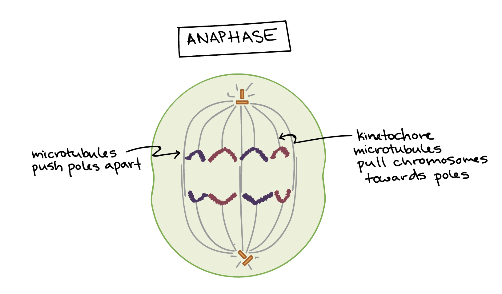

## Cell Theory & Organelles

### Characteristics Of Living Things

**Genes**: All living things inherit genes + traits from their parents. This is also known as heredity

**Reproduction**: All living things reproduce sexually (ʘ ʖ̯ ʘ) or asexually

**Adaptation & Evolution**: All living things can adapt to their environment

**Metabolism**: All living things need energy in order to carry out the chemical reactions in the body

**Irritability**: All living things feel stimuli (such as pain)

**Cells**: All living things are composed of cells

### Cell Theory

Biology is a science based on **cell theory**.

**Cell theory** states that:
- All living things are made of cells
- The cell is the simplest unit that can carry out all life processes
- All cells reproduce & are reproduced from other cells

## Prokaryotes & Eukaryotes

All living things are made up of cells. They can either be simple or complex.

There are 2 types of cells.
- Cells that contain a nucleus & other **organelles**, each surrounded by a thin membrane.
- Cells that don't have a nucleus or membrane-bound organelles.

### Prokaryotes

**Prokaryotes** are simply lifeforms. They are single celled & lack a nucleus.

An example of a prokaryote is bacterium.

### Eukaryotes

**Eukaryotes** are complex organisms. They can be single or multi-celled organisms. They have a nucleus.

Eukaryotes are much largers than prokaryote cells & are often 10-1000x larger.

Examples of eukaryotes are plants & animals.

## Function & Structure Of Cells

All cells perform certain basic activities to stay alive. These activities are performed by **organelles**. **Organelles** are a specialized cell part. Each organelle has a specific function. They work together to meet the needs of the cell. Plant & animal cells have many common structures. Hoevever, plant cells have organelles that animal cells do not.

**Plant Cell**

**Animal Cell**

### Organelle List
| Organelle                 | Function                                                                                                                                                                                      |
| ------------------------- | --------------------------------------------------------------------------------------------------------------------------------------------------------------------------------------------- |
| Cytoplasm                 | Fluid surrounding organelles inside the cell membrane. It's mostly water & stores substances the cell needs. It's where many chemical reactions take place.                                   |
| Cell Membrane             | A flexible double-layered support structure surrounding the cell. Allows substances in & out of the cell.                                                                                   |
| Nucleus                   | A spherical structure in the cell. Where genetic information which controls all activities is stored in chromosomes.                                                                          |
| Mitochrondria             | The powerhouse of the cell. (╰（‵□′）╯) It makes energy available to the cell via cellular respiration (needs O2). Enzymes in the **mitochondria** convert glucose into energy.    |
| Golgi Bodies              | Collects & processes materials to be removed from the cell & folding/adding to proteins to be used for other organelles. Produces mucus.                                                                                                                 |
| Vacuoles                  | Sacs for storage, maintaining fluid pressure & removing substances from cell.                                                                                                               |
| Ribosomes                 | Synthesizes proteins.                                                                                                                                                                    |
| Endoplasmic Reticulum     | Network of tubes which extend from the **nucleus** to **cell membrane**. It transports protein throughout the cell. Smooth ER makes lipids while the Rough ER helps make & package proteins |
| Cell Wall (Plant Only)    | Rigid, porous structure which provides support & protection for the cell.                                                                                                                   |
| Vacuole (Plant Only)      | 1 Large vacuole to maintain turgor pressure of cell.                                                                                                                                          |
| Chloroplasts (Plant Only) | Absorbs light & converts it to glucose & O2. Contains chlorophyll.                                                                                                             |
| Vesicles                  | Membrane covered sac which store/transport materials inside the cell. Help materials cross the cell membrane in/out of the cell.                                                              |
| Cytoskeleton              | Filament & tubules that provide a framework which maintains the cell structure. Provides tracks along which vesicles & organelles can move.                                                 |
| Lysosomes                 | Organelles within the cytoplasm which break down waste products, fats, protein, carbs that are no longer useful.                                                                              |

## Microscopes

### Parts Of A Microscope

| Part                   | Function                                                                |
| ---------------------- | ----------------------------------------------------------------------- |
| Stage                  | Used to hold slide. Also allows light through for specimen to be viewed |
| Stage Clips            | Used to hold slide in place on stage                                    |
| Diaphragm              | Used to control amount of light the goes through the specimen           |
| Objective Lenses       | Used to magnify the specimen. Usually 3 (Low, Medium, High)             |
| Revolving Nose Piece   | Used to rotate between lenses                                           |
| Eyepiece (Ocular Lens) | Used to view specimen                                                   |
| Coarse Adjustment      | Used to focus on specimen. Only use with low power lens.                |
| Fine Adjustment        | Used for finer focusing. Only use with high/med power lenses.                                                                        |

### Magnification

**Magnification** = Lens Power X Ocular Lens Power
| Power | Lens Power | Ocular Lens Power | Total Magnification |
| ----- | ---------- | ----------------- | ------------------- |
| Low   | 4X         | 10X               | 40X                 |
| Med   | 10X        | 10X               | 100X                |
| High  | 40X        | 10X               | 400X                    |

## Cell Cycle

The cell cycle is a series of events which take place in a cell as it grows & divides. The resulting **daughter cells** will then begin their own round of the cell cycle.

In a eukaryotic cell, the cell cycle is divided into 2 major phases. The **Interphase** & **Mitotic**.

### Why divide?
As a cell gets bigger, it's harder to transport materials & waste around the cell. Cells need to transport these materials & waste in & out of the cell quickly unless it wants to die. If the cell becomes larger, it becomes inefficient & can poison itself as a result. Therefore, it divides.

### Interphase

During **Interphase**, the cell grows & makes copies of its DNA. In order to first divide a cell, it needs to go through interphase, This preparation happens in 3 steps.

There are checks throughout these phases to ensure that organelles grow properly, DNA is copied properly, the cell has grown enough, etc.

#### G1 Phase
During the **G1 phase** (aka the first gap phase), the cell grows larger, copies organelles & kaes the molecular building blocks it requires in the later steps.

#### S Phase
In the **S phase**, the DNA in the cell's nucleus is copied & synthesized. It also duplicates a microtubule-organizing structure called the **centrosome**. The centrosomes which help separate DNA during **Mitosis**. 

#### G2 Phase
During the **G2 Phase** (aka the second gap phase), the cell grows more, makes organelles, & begins to reorganize its contents for mitosis. This phase ends when mitosis begins.

### Mitotic Phase

During the **Mitotic Phase** (aka the "M" phase), the cell divides its copied DNA & cytoplasm to make 2 new cells. The mitotic phase involves 2 devision-related processes: **Mitosis** & **Cytokinesis**.

#### Mitosis

In **Mitosis**, the DNA in the cell condenses into visible chromosomes & is pulled apart by the **mitotic spindle** ( a specialized structure made of microtubules). Mitosis takes place in 4 phases: **Prophase**, **Metaphase**, **Anaphase** & **Telophase**.

The goal of mitosis is to ensure each daughter cell gets a perfect set of chromosomes. Cells that don't have enough or too many chromsomes don't function well. So when cells undergo mitosis, they split their chromosomes into their daughter cells equally in an organized series of steps.

##### Prophase
In the early prophase, the cell starts to break down some structures & build up others. This sets the stage for division of the chromosomes. Chromosomes will start to condense which makes them easier to pull apart while also making them visible. The **mitotic spindle** begins to form. The spindle is made of microtubles. It's job to organize chromosomes & move them around during mitosis. The spindle grows between the centrosomes as they move apart. The nucleolus disappears. 

In the late prophase, the mitotic spindle begins to capture & organize the chromosomes. THe chromosomes become even more condensed. The nuclear envelope breaks down & the mitotic spindle grows more. The microtublues start to capture chromosomes.

Microtubules bind to chromosomes at the **kinetochore** (a patch of protein found on the centromere of each chromatid). **Centromeres** are the regions of DNA where sister chromatides are most tightly connected.

##### Metaphase

In **Metaphase**, the spindle has captured all the chromosomes & lined them at the equator of the cell. Before moving to the **Anaphase**, the cell will check to makes sure that all the chromosomes are where they should be at the equator. This is called the **spindle chackpoint** & helps ensure that the chromotids will split evenly between the daughter cells when they separate. If this check is not fulfilled, the cell will simply halt the cycle until it can be corrected.

##### Anaphase

During **Anaphase**, the sister chromatids separate from each other & are pulled towards the opposite ends of the cell. All these processes are driven by motor proties (molecular machines that can "walk" along microtubule tracks & carry a cargo). In mitosis, motor proteins carry chromosomes or microtubles as they "walk".

##### Telophase

In the **Telophase**, the cell is nearly done dividing & starts to re-establish its normal structures as **Cytokinesis** takes place. The mitotic spindle breaks down into its building blocks. 2 nuclei form for each set of chromosomes. The nucleoli & nuclear membranes reappear. The chromosomes begin to decondense & return to their normal form.

#### Cytokinesis

**Cytokinesis** is the division of the cytoplasm in order to form 2 new cells. It overlaps with the final stages of mitosis. It either starts in the **Anaphase** or **Telophase** depnding on the cell & will finish shortly after the telophase. This happens differently depending on whether the cell is a plant or animal cell.

In animal cells, the cytokinesis pinches the cell in 2 like a drawstring bag. The "drawstring" is a band of filaments made of protein called actin & the crease is known as the cleavage furrow.

Plant cells cannot be divided like this as they have a cell wall. Instead, a structure called the cell plate forms down the middle of the cell which splits & separates the 2 daughter cells.

The cycle is thus completed & the 2 daughter cells will continue the cycle.

## Cancer
**Cancer** is a disease in which mutated cells (mistakes in their DNA) divide uncontrollably. These cells ignore cell-cycle checkpoints.

### Tumors
Cancerous cells divide repeatedly & form clumps of cells called tumors. Tumors don't perform normal functions an potentially damage surrounding tissue. They can either be **benign** (non spreading) or **malignant** (spreading).

#### Metastasis
When a **primary tumor** develops & recruits blood vessels. Cancerous cells then break off & enter blood vessels. These cells then spread to other areas in the body.

#### Melanoma (ABCD Rule)
How to tell the difference between melanoma (skin cancer) & a benign mole:
- **A**symmetric - The mole is asymmetric
- **B**order irregularity - The border is not smooth or consistent.
- Multiple **C**olours - Mole is multiple colours.
- **D**iameter > 6 - The mole is larger than a pencil eraser.

### Causes of Cancer
| Cause                | Comments                   |
| -------------------- | -------------------------- |
| Genetics             | Genes inherited by parents |
| Chemical Carcinogens | Example: Tobacco           |
| Radiation            | UV rays from the sun       |
| Viruses              | Example: HPV               |
| Spontaneous Mutation | Completely random mutation of cells. God really hates you & life fucked you in the ass.                           |

Most cancers take years to develop & are caused by multiple factors.

### How is cancer treated
**Radiation**: Cancerous cells & tumors are killed using high energy x-rays, gamma rays, etc
**Chemotherapy**: Chemicals target rapidly dividing cells

### How to not get cancer
- Eat healthy
- Don't smoke
- Regular check-ups & health evaluations
- Wear sunscreen to reduce exposure to UV radiation

## Stem Cells

**Stems cells** are unspecialized cells. They can become many different kinds of cells.

### Embryonic Stem Cells

**Embryonic Stem Cells** are totipotent (they can develop into any type of cell) stem cells found in embryos.

### Adult (Tissue) Stem Cells

Within a week of fertlization, the embryonic stem cells become differentiated. There are now tissue stem cells witch are **pluripotent** (they can only develop into some types of cells tat are in their stem cell niche).

### Examples

| Type Of Stem Cells     | What can they form                     |
| ---------------------- | -------------------------------------- |
| Body Tissue Stem Cells | Same kind of tissue (Liver, skin, etc) |
| Bone Marrow            | Any blood cell                         |
| Umbilical Cord Blood   | Bone, muscle, nerves, blood vessels                                       |

### Benefits
- Replacing damaged tissue
- New treatments for cancer
- New medical therapies (eg. treatment for spinal cord injuries)

### Controversies
Embryonic stem cells can be produced via fertility treaments & cloning. Some believe it's unethical to create cells which could develop into a human being.

## Specialized Cells

**Specialized Cells** have physical & chemical differences that allow them to perform one job very well.

Unspecialized cells go through a process called **cell differentiation** to become specialized cells.

Lung tissue cells are different from brain cells which are different from intestinal cells & so on & so forth.

### Specialized Calls - Animals

#### Red Blood Cells

- Contains hemoglobin that carries O2 in the blood.
- Smooth so they can pass through blood vessels easily

#### White Blood Cells

- Move like amoeba
- Engulf invading bacteria to kill it & fight infection

#### Muscle Cells

- Arranged in bundles called muscle fibers
- Controct & shortens causing bons to move

#### Fat Cells

- Stores chemical energy
- Have large vacuoles which store fat molecules

#### Skin Cells

- Layers of cells which tightly cover the body
- Protects cells inside & reduces water loss

#### Nerve Cells

- Long, thin, with many branches
- Conduct electrical impulses to coordinate body activity

#### Bone Cells

- Collects Ca from food which is required for the growth & repair of bones
- Builds bones around themselves which build up the skeleton

#### Sperm ( ͡° ͜ʖ ͡°) Cells
- Carry DNA from male parent to join with the DNA of the female parent.
- Hase a flagellum to allow movement

### Specialized Cells - Plants

#### Xylem Cells

Moves water & minerals through the plant.

#### Phloem Cells

Move sugars through the plant.

#### Ground Tissue Cells

Storage of starch & energy for the plant.

#### Epidermal Cells

Protect the plant & facilitates water absorption from roots.

#### Photosynthetic Cells

Contain chloroplasts which collect energy from the sun to make sugar for the plant.

#### Guard Cells

Controls water loss from the leaves of plants.

## Levels Of Organization

The levels or organization is a hierarchy with the most complex at the top & least complex at the bottom.
| Levels of Organization |              |
| ---------------------- | ------------ |
| Organism               | Most Complex |
| Organ System           |              |
| Organ                  |              |
| Tissue                 |              |
| Cell                   | Simplest             |

## Tissues

**Tissues** are a group of similar cells which perform a particular function.

### Epithelial Tissue

**Epithelial** tissues are thin sheets of tightly packed cells that cover body surfaces & line internal organs & body cavities. 

#### Function

- Provides protection from dehydration
- Low-friction surfaces

#### Examples

- Skin
- Lining of digestive system

### Connective Tissue

Various types of cells & fibres held together by a liquid, solid or gel called a matrix.

#### Functions

- Support
- Insulation

#### Examples

- Bone
- Tendons
- Blood
- Fat

### Muscle Tissue

**Muscle tissue** are bundles of long cells called muscle fibres which have specialized proteins which can contract & relax which enables movement. They can be smooth or **striated** (has lines, bands or grooves)

#### Function

- Allows movement of body parts

#### Examples

- Heart Muscles
- Muscles which make our bones move
- Muscles surrounding the digestive tract

### Nerve Tissue

Long thin cells with fine branches at the ends which transmit electrical signals from one part of the body to another.

#### Function

- Senses
- Communication within the body
- Coodinating body functions

#### Examples

- Brains
- Nerves throughout our bodies

## Organs

Organs are structures made of different tissues which work together to perform a complex body function.

### Examples

- Stomach
- Heart
- Lungs

## Organ Systems

A group of one or more organs/structures that work together to perform a major & vital body function.

There are 11 major systems:
| System                | Function                                             |
| --------------------- | ---------------------------------------------------- |
| Digestive             | Takes in & breaks down food. Disposes of solid waste |
| Circulatory           | Transports blood, nutrients & gases                  |
| Nervous               | Senses & controls responses to the environment       |
| Respiratory           | Gas exchange system                                  |
| Skeletal              | Supports & protects soft tissues                     |
| Muscular              | Works with the skeletal system to enable movement    |
| Immune                | Defends against infections                           |
| Reproductive (ʘ ͟ʖ ʘ) | Produces offspring                                   |
| Endocrine             | Makes hormanes & keeps systems in balance            |
| Excretory             | Disposes liquid waste                                |
| Integumentary         | Protective barrier                                   |

### Digestive System

#### Functions

- Taking in food
- Breaking down food
- Digesting food
- Ejecting waste from the body

#### Digestive Tract

The digestive tract is long tube with 2 openings.

In humans, the tube consists of:
- Mouth
- Esophagus
- Stomach
- Small intestine
- Large intesting
- Anus

With a few accessory organs:
- Liver
- Gall Bladder
- Pancreas
These accessory organs secrete chemicals which help digest food.

##### Tissues In The Digestive Tract

The entire tract is lined with **epithelial tissues**. On type of epithelial cell is called a **Goblet Cell** (a cell which excretes mucus). The mucus protects the digestive tract from enzyms & allows materials to pass smoothly along the digestive tract. 

The tract also includes layers of muscles (to allow food to move through the tract), connective tissue for support, & nerve tissue to communicate with the rest of the body to notify you when you're hungry, full, etc.

##### Mouth

The mouth breaks down food in 2 ways. **Mechanically** using your teeth & tongue & **Chemically** with the use of enzymes.

##### Esophagus

The **esophagus** is a muscular tube that connects the moth to the stomach. The muscles are a special type iof muscles called **smooth muscle tissues**. These muscles can contract & relax without conscious effort. It's movement is controlled by nerve tissue. 

Food enters the mouth then the **pharynx** (a combined passageway for food & air) which then moves into the esophagus. Wavelike contractions called **peristalsis** moves food down to the stomach.

##### Stomach

Mechanical & chemical digestion occur here. The stomach churns & moves food around which breaks it down into smaller pieces. This is controlled by smooth muscle tissue. Chemically, the stomach lining cells secrete enzymes & HCl to break down food. The stomach has nerve cells which signal when we're full.

##### Small Intestines

The small intestine is lined with **goblet cells** which produce mucus, contain **capillaries** which connect the digestive system to the circulatory system, contain villi (tiny bumps) which increases the absorption of nutrients into the bloodstream. This is where most **chemical digestion** & absorption of nutrients takes place.

Nutrients diffuse through the cell walls into the bloodstream.

The small intestine is 6m long but is highly folded. It also has a small diameter.

##### Large Intestines

Like the small intestine, the large intestine is lined with goblet cells. It contains smooth muscles aswell.

The large intestine is large in diameter but shorter in length (1.5m) compared to the small intestine.

Water is reabsorbed from undigested food here & leads to the anus (ʘ ʖ̯ ʘ).

##### Rectum

The muscle that stores waste.

##### Anus

Ejects waste from the digestive system.

##### Liver

Makes bile & sends it to the Gall Bladder.

##### Bile

Breaks down fat.

##### Gall Bladder

Stores bile & secretes it to the small intestine as needed.

##### Pancreas

Produces insulin which regulates blood sugar. Too little or too much insulin will lead to diabetes.

### Circulatory System

The circulatory system is made up of blood, the heart & blood vessels.

#### Functions
- Transports substances around the body.
- Regulation of body temperature.
- Transport **white blood cells** to areas of the body where there is bacteria or viruses.

#### Pathway Of Blood
1. Heart
2. Arteries
3. Smaller blood vessels
4. Capillaries
5. Exchange at cells
6. Capillaries
7. Smaller blood vessels
8. Veins
9. Heart

#### Blood

**Blood** is a type of connective tissue. It consists of 4 components:
- Red blood cells
- White blood cells
- Platelets
- Plasma

##### Red Blood Cells (RBC)

RBC contain hemoglobin which is a protein that makes them red & allows them to carry O2 throughout the body. It makes up approximately 50% of blood's volume.

##### White Blood Cells (WBC)

WBC are cells which fight infection. They recognize & destroy bacteria & viruses. They make up less than 1% of blood's volume.

##### Platelets

**Platelets** help with blood clotting. They make up less than 1% of blood's volume.

##### Plasma

**Plasma** is a protein-rich liquid which carries blood cells along. It makes up over 50% of blood's volume.

#### Heart

The **heart** is made up of cardiac muscular tissue, nerve tissue, & connective tissue. The cardiac muscle tissue contracts & pumps with a steady & regular beat. The muscles & nerves are covered by epithelial tissue to reduce friction & protects the heart from damage when the lungs expands & contract. The inner suface of the heart is lined for blood to flow easier.

#### Blood Vessels

##### Arteries

- Carries blood away from the heart
- Has the thickest walls
- Under the most pressure

##### Veins

- Carries blood towards the heart
- Thinner walls
- Under less pressure

##### Capillaries

- Connect arteries & veins
- Tiny blood vessels with very thin walls
- Allows substances to diffuse between the blood & other fluids & tissues.

### Respiratory System

The respiratory system is responsible for the body's gas exchange. It's responsible for providing O2 needed by the body & releasing CO2 produced as your body uses energy for growth, repair & movement. The respiratory system relies on the **circulatory** system to distribute O2 to the cells & remove CO2.

#### Function

- Provides O2 to cells
- Removes CO2 that is produced in cells
- Site of gas exchange

#### Nose

Entry for air. Filters, warms & moistens air. Hairs called cilia protect the nasal passageways & filters particles.

#### Mouth

The mouth can contain both food & air (obviously). Same function as nose.

#### Pharynx

Carries both food & air. Used for digestion & respiration. 2 Paths: esophagus & trachea. When you swallow, a flap of tissue called the **epiglottis** covers the opening to the **trachea**. This prevents liquids & food entering the lungs. If food or liquid gets into the trachea (like me whenever I swallow water), the resulting cough is your body's attempt to get rid of it. 

#### Trachea

The trachea is surrounded by rings of cartilage. The cartilage helps keep the trachea open & allows air to flow freely. Cells lining the trachea have **cilia** & goblet cells to trap & filter out foreign materials entering the respiratory system.

#### Bronchi/Bronchus

Each bronchi branches into smaller air sacs called **alveoli**. Structures enable fresh air to get to air sacs.

#### Alveoli

Alveoli are tiny air sacs surrounded by a network of capillaries. They are thin walled to allow diffusion of gases. Blood flowing to the lung has low O2 & high CO2 concentrations. The O2 concentration is high in the alveolus while CO2 concentration is low. O2 diffuse from the alveolus into caollaries while CO2 goes the other way. This is the gas exchange. 

#### Lungs

Pathway for oxygen entering the bloodstream. Structures enable fresh air to get to air sacs.

#### Breathing

- Happens unconsciously (unless you think about it...)
- The process of moving air into the lungs (**inhalation**) & pushing the air out (**exhalation**).
- Involves muscles that move the lungs which makes the rib cage expand & contract.
- Involves the **diaphragm**, a large sheet of muscles.

**Inhaling**
The diaphragm contracts which increases the lung volume, decreases pressure, & moves air into lungs.

**Exhaling**
The diaphragm relaxes which decreases lung volume, increases pressure, & moves air out of the the lungs.

#### Diseases

##### Tuberculosis
- Infectious disease
- Caused by bacteria which enters the body when you breathe.
- Bacteria grows in the lungs & spreads to other parts of the body.

###### Symptoms
- Fever
- Cough
- Weight loss
- Tiredness
- Chest pain
- Death (if untreated)

##### SARS (Severe Acute Respiratory Syndrom)
- Flu-like symptoms (X-rays show pneumonia)
- 438 cases in Canada with 44 deaths.

##### Lung Cancer
- Caused by carcinogens

### Musculoskeletal System

An organ system made up of bones & skeletal muscle.

#### Functions

- Supports the body
- Protects delecate organs
- Allows movement

#### Structural Features

- Connective Tissue
- Muscles

There are 3 types of **connective tissue**.
- Bones
- Ligaments
- Cartilage

##### Bones

- Made of minerals (Ca, P) & collagen fibres.
- Small canals for nerves & blood vessels.
- Hard & dense

##### Ligaments

- Tough, elastic connective tissues
- Holds bones together at joints
- Made of long fibres of collagen

##### Cartilage

- Dense connective tissue
- Strong, flexible, low-friction support for bones & tissues, (Nose, ear, esophagus, etc)

##### Muscles

- Bundles of long cells
- Contract & expand when signalled by nerve cells.
- Muscles contract - get shorter & thicker
- Skeletal muscle attached to bone by tendons

Types of muscles:
- Voluntary
- Involunary

#### Skeleton

The **skeleton** provides support, protection & movement. It's support for our bodies & anchor points for muscles. It protects internal organs & the brain. Stores Ca & minerals needed by organism.

##### Function Of The Skeleton
- Production of white & red blood cells. Cartilage provides smooth surface where bones come togeth at joins preventing to the ends of bones. Skeletal muscles used for voluntary movements.

#### Musculoskeletal Disease

##### Osteoporosis
- Loss of bone tissue/Ca
- Makes bones brittle & weak
- Common in older women
- Simply use Ca & vitamin supplements.

### Nervous System

The nervous system is made up of the brain, spinal cord, & peripheral nerves. It senses the environment & returns an appropriate response. 

The core of the nervous system is the brain & spinal cord. These are protected by bones & cerebrospinal fluid. This is called the central nervous system.

#### Peripheral Nervous System

- Nerves that carry the signals between the central nervous system & body,
- Relays instructions from the brain to other pody parts to control its functions & responses.
- Consists of nerves that carry signals between the central nervous system and body

#### Nerve Tissue

Nerves are bundles of cells called **neurons** surrounded by connective tissue.

**Neurons** are communication specialists that send information around the body via electrical signals. There are approx. 100 billion neurons in the human brain.

**Nerves** allow 2-way flow of information while **neurons** only transmit information in 1 direction.

Injured neurons do not regenerate easily. However, some neurons can regrow to repair small gaps between nerves.

#### Sensory Receptors

Special cells/tissues that receive input from the external environment & send signals to the central nervous system. Information from different sensory receptors goes to specific parts of the brain. Our eyes, noes, mouth, ears, muscles, & skin have sensory receptors.

#### Reflexes

Reflexes are actions that do not require the involvement of the brain. In other words, they occur without conscious thought. The spinal cord acts for reflexes. An example is if you hit your knee, your leg will move.