## Basic/Misc Science Knowledge

### Definitions

**Pure substances** are substances which have a constant chemical composition. They are made of one element or compound. An example is salt.

**Mixtures** are when substances are generally mixed without undergoing a chemical change and are not completely dissolved. An example is salt and pepper mixed.

**Solutions** are when substances are dissolved completely and cannot be filtered out. It's a type of homogeneous mixture. A solution consists of a solute and solvent. An example is salt water.

**Homogeneous** mixtures are mixtures where the components used to make the mixture are uniformly distributed throughout the mixture. An example is vinegar.

**Heterogeneous** mixtures are mixtures where the components are not uniform. An example is cereal and milk.

**Precipitates** are an insoluble compound. This is a solid by either decreasing the solubility of a compound or reacting 2 salt solutions.

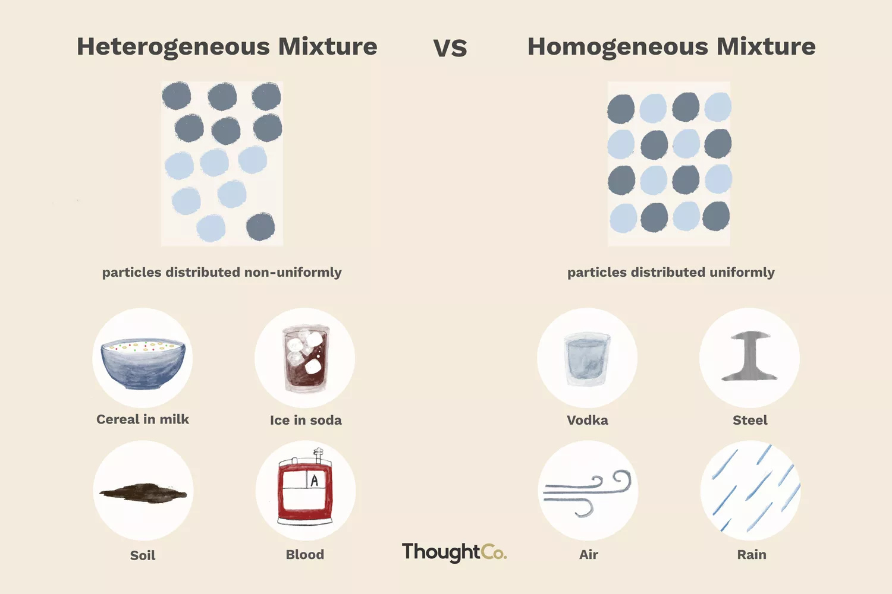

	
## Periodic Table & Atomic Structure

### Definitions

**Atom:** The smallest unit of matter that cannot be broken down by chemical means.

**Subatomic Particles:** Particles smaller than the size of an atom.
| Info             | Protons                  | Electrons              | Neutrons                   | Nucleus                              | Electron Shells                      |
| ---------------- | ------------------------ | ---------------------- | -------------------------- | ------------------------------------ | ------------------------------------ |
| Location         | Nucleus                  | Electron Shells        | Nucleus                    | N/A                                  | N/A                                  |
| Charge           | +1                       | -1                     | 0                          | N/A                                  | N/A                                  |
| Notation         | p+            | e-          | n0              | N/A                                  | N/A                                  |
| Mass             | Have mass                | Almost no mass         | Have mass                  | 99% of mass and 1% of volume of atom | 1% of mass and 99% of volume of atom |
| Additional Notes | Same amount as electrons | Same amount as protons | Atomic Mass - # of protons |                                      | First 3 shells hold: 2, 8, 8                                     |

**Valence Electrons:** Electrons in the outer shell/valence shell of an atom. Determines the chemical properties of elements.

**Bohr Rutherford Diagrams:** A diagram used to represent the structure of an atom
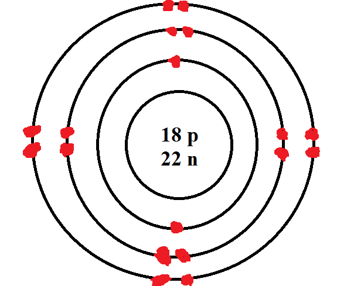

**Lewis Dot Diagrams:** A diagram used to represent valence electrons of an atom.

**Periodic Table Of Elements:** A rows and columns arrangement of chemical elements.
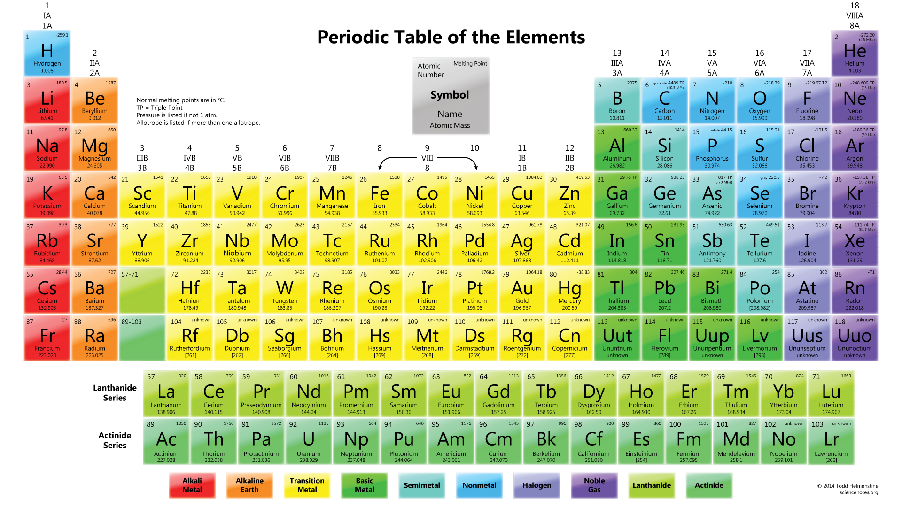

### Atoms

- All atoms are neutral (thus the amount of protons are equal to the number of electrons)
- Both protons and neutrons contribute into atomic mass.
- Protons and Neutrons are located in the nucleus while electrons orbit the nucleus in shells
- Each shell holds a different amount of electrons. 
1. Ring 1 holds 2
2. Ring 2 holds 8
3. Ring 3 holds 8
- Atoms can be represented as Lewis Dot Diagrams or Bohr Rutherford Diagrams (see definitions)

### Periodic Table Of Elements

The periodic table is ordered by how many protons and electron the element has. It's further grouped into families (such as noble gases, non-metals, halogens, etc) based on their properties.

Metals are to the left of the periodic table while non-metals are to the right.

| Name                  | Group | Properties                                                                                      |
| --------------------- | ----- | ----------------------------------------------------------------------------------------------- |
| Alkali Metals         | 1A    | These metals are soft and can be easily cut. Highly Reactive. 1 loosely bound valence electron. |
| Alkaline Earth Metals | 2A    | Low melting points. 2 valence electrons. Creates a strong base when mixed with water.           |
| Transition Metals     | 3B-2B | Very hard. High melting points.                                                                 |
| Halogens              | 7A    | Non-metal. Varying physical properties. Highly reactive.                                        |
| Metalloid             | N/A   | Exhibits properties of both metals and non-metals. Reactivity depends on other element. Properties vary widely.                                                                                                |
| Noble Gases           | 8A    | Fairly non-reactive. Complete valence shells                                                    |
| Non-metals            | 4A-6A | May be solid, gas, or liquid. Not a metal.                                                                                                |

**How to find # of Protons, Electrons & Neutrons** 
| Particle | Equation | Where To Find On A Periodic Table |
| -------- | -------- | --------------------------------- |
| Proton   |p+ = e-   | Atomic Number                                  |
| Electron |p+ = e-   | Atomic Number                                  |
| Neutrons |Atomic Mass - # Of Protons  | N/A                               |

**Standard Notation**
You may be asked to write an element in "Standard Atomic Notation"
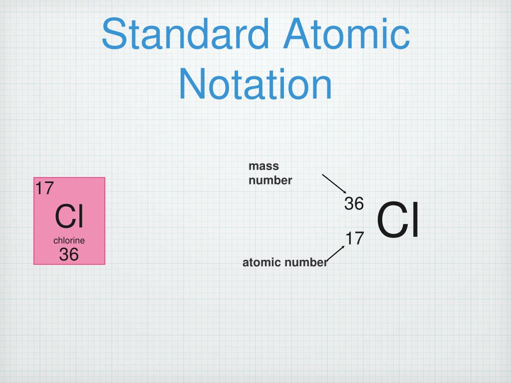

## Physical & Chemical Properties & Changes

**Physical Properties** are properties observable by our 5 senses (touch, taste, smell, sight, sound)

**Chemical Properties** are properties based on how they react with other substances. (Eg. combustibility, stablility, reactivity)

During **Physical Changes**, the particles involved remain intact. No chemical bonds are broken and no new bonds are made. No new substances are formed. Therefore, all properties stay the same. (Eg. Water evaporating)

In **Chemical Changes**, chemical bonds are broken or formed. The particles produced are different in their arrangements of atoms and therefore have different physical and chemical properties. New substances are formed. (Eg. Electrolysis)

In order to determine whether a change is physical or chemical. 
Some easy indicators of a chemical change are:
- Production of light
- Change of temperature
- Change in color
- A substance is produced (usually a gas)
- Odour change
If the results of the change exhibit any of these changes, then it suggests that the change is likely a chemical change.

During a chemical change, gas may be produced. There are tests to determine what gas is produced. These confirm that a chemical change has occurred.

**Note:** A splint is simply a wood strip. 
Glowing means that the splint's ember is still glowing hot. 
Lighted means the splint is ignited
| Gas            | Test                             |
| -------------- | -------------------------------- |
| Oxygen         | Glowing splint should reignite   |
| Hydrogen       | Lighted splint will make a pop   |
| Carbon Dioxide | Lighted splint should extinguish |
**Note:** The hydrogen test is the coolest out of all of them. Here's a clip. It's better in person though.
<iframe width="560" height="315" src="https://www.youtube.com/embed/cDca_XvU88Q?start=58" title="YouTube video player" frameborder="0" allow="accelerometer; autoplay; clipboard-write; encrypted-media; gyroscope; picture-in-picture; web-share" allowfullscreen></iframe>

## Ions

Atoms are neutral because they have the same number of protons and electrons. However, they want to be neutral **and** have a full valence shell. In order to have a full valence shell, they can gain and lose electrons (not protons though because they're in the nucleus and you would need to split open the nucleus to lose and gain protons. Gaining and losing electrons is just easier for atoms.)

When atoms lose and gain electrons to have a full valence shell, they are no longer neutral.

If they lose electrons, they become positive and are call **cations** (pronounced cat-ions).

If they gain electrons, they become negative and are call **anions** (pronounced an-ions). 

**Note:** An easy way to remember is that cats make you feel happy and therefore positive (cations). Onions make you cry and therefore negative (anions).

The way we draw Bohr Rutherford and Lewis Dot diagrams are different for ions.

**Bohr Rutherford Diagram For Sulfur**
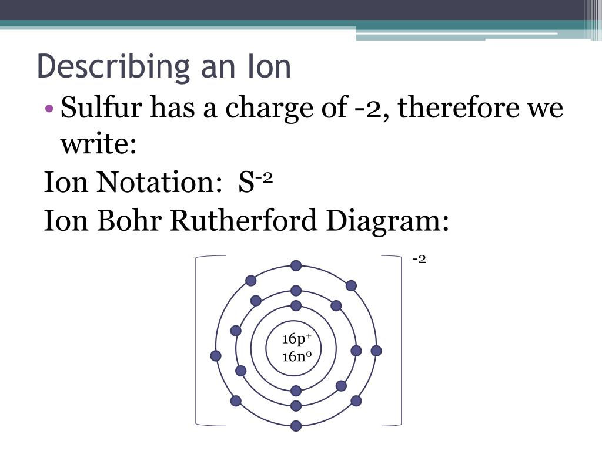

**Lewis Dot Diagram For Oxygen**
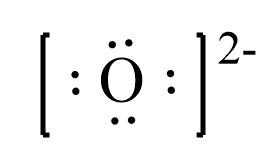
**Note:** If the ion is a cation, you would simply not have any dots in the Lewis Dot diagram

When naming ions, it depends on the type of element. 

If it's a metal, you would call it "*element* ion"
For example, Magnesium (Mg) would be called "Magnesium Ion"

If it's a non-metal, you drop the ending of the element & add the suffix "ide".
For example, Oxygen (O) would be called "Oxide"

## Binary Ionic Compounds

As mentioned before, atoms want to be neutral and have a full valence shell. By becoming ions, they are no longer neutral but have a full valence shell. Ionic compounds are where a metal cation attracts non-metal anion and creates an ionic compound with an overall charge of 0. Binary ionic compounds are made up of only 1 metal and 1 non-metal.
An examples include:
- Lithium Fluoride (LiF)
- Sodium Oxide (Na2O)
- Calcium Sulfide (CaS)

There are 2 ways of writing a compounds:

#### Naming Binary Ionic Compounds

When naming a binary ionic compound, it's fairly easy. The first ion is your metal. You would write it as it's named in the periodic table of elements. The second ion is your non-metal. You have to first drop the ending of the element (Phosphorus -> Phosph), then add the suffix "ide" (Phosph -> Phosphide).

**Note:** There's no concrete procedure for where to cut off the end. Some elements like Nitrogen (Nitride) may be counterintuitive (at least in my experience). Don't be afraid to look it up. You'll eventually remember the notable ones.

Examples:
Potassium Nitrogen -> Potassium Nitride
Aluminum Phosphorus -> Aluminum Phosphide

#### Writing Binary Ionic Compound Formulas

You may also express a compound as a formula. When writing a formula, you will need the symbol for both ions. This can be found on the periodic table.

**Note:** These symbols are case sensitive so ensure you write them as they are!

Example:
Magnesium Oxide -> MgO

Sometimes, this is enough as both the Magnesium Ion and Oxide are both neutral and you're done!

However, the goal of an ionic compound is that every atom has a full valence shell and is **neutral**. Ions are not neutral because they have a different number of protons and electrons. Therefore, they can form ionic bonds and transfer electrons to another ion that needs it. 

**Visual Example:**
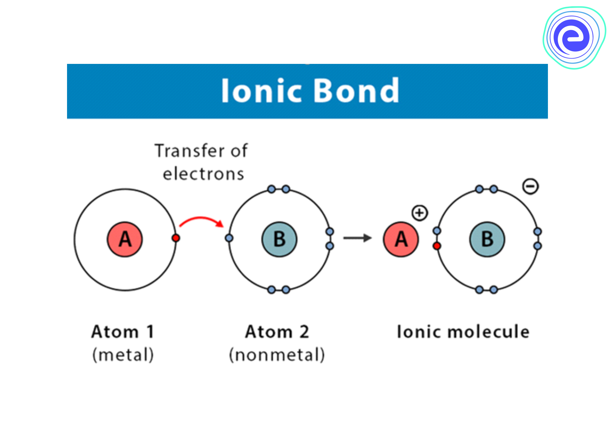

A single ion can only give or take so much until it's neutral. 

That's when you can have multiple of an element's atoms in a compound.

For example, Lithium Oxide. Oxygen requires 2 electrons to have a full valence shell while Lithium needs to give away one. Lithium doesn't have enough valence electrons to satify the Oxide. So to fix this, we can introduce another Lithium Ion that can give it's electron to Oxide. 

To show that we have 2 Lithium Ions in our compound, we can use a subscript (we don't need to do it for Oxide as without a subscript, it's implied that there's only 1 ion)

Our formula would be: Li2O

There's many ways to determine how many of each ion we need but the easiest for compounds with 2 ions is the "chriss-cross method". 
Steps
1.  Write the symbols for your ions (Aluminum Selenide -> AlSe)
2. Find the ion charge for both ions on your periodic table (Aluminum Ion Charge = 3+, Selenide Ion Charge = 2-)
3. Remove the +/- from the ion charges (3, 2)
4. Use those ion charges as the other ion's subscript (Al2Se3)

**Simplifying**
If you have 2 ions with the same subscript or they can be divided by the same number (Al3P3, Mn2O4), you can simplify it like a fraction (AlP, MnO2)

## Multivalent Metals

Some transition metals have more than one ion. These are called **multivalent metals**. When naming compounds or writing formulas involving these elements, you must indicate which ion is being used in the compound.
**Note:** These elements have multiple ion charges listed in the periodic table.
Examples:
- Gold
- Iron
- Mercury
- Platinum

#### Naming Multivalent Compounds

When naming a multivalent compound, you must write the roman numeral for the charge number in brackets next to the metal.

Examples:
- Tin(II)
- Lead(IV)
- Copper(I)

#### Using Multivalent Metals In Formulas

You can simply write the formula with the numeral next to the metal as the ionic charge.

Example:
Iron(III) Sulfide -> Fe2S3

## Polyatomic Ions
Polyatomic Ions are ions which contain several nonmetal atoms. Polyatomic ions act as a single ion and have special names.

**Common Polyatomic Ions**
**Note:** The superscript is the ion charge of the polyatomic ion. (They have them too!)
| Ion                              | Formula                       |
| -------------------------------- | ----------------------------- |
| Nitrate                          | NO3-    |
| Hydroxide                        | OH-                |
| Bicarbonate (Hydrogen Carbonate) | HCO3-   |
| Chlorate                         | ClO3-   |
| Carbonate                        | CO32-   |
| Sulphate                         | SO42-   |
| Phosphate                        | PO43-   |
| Ammonium                         | NH4+    |
| Chromate                         | CrO42-  |
| Thiocyanate                      | SCN-               |
| Acetate                          | CH2COO- |

When using a polyatomic ion, you treat it as **one** ion. Never separate the ion in any way, shape, or form!

**NOTE:** When you need to add a subscript to a polyatomic ion, put the ion in brackets ( "(PO4)2" )

Examples:
Calcium Chlorate -> Ca(ClO3)2
Potassium Sulphate -> K2SO4

## Covalent Compounds

**Covalent bonds** are when a chemical bond is formed between 2 atoms when they share electron pairs. When atoms come near each other, their electrons (being negative) are atracted to the other atom's nucleus (which is positive). Elements which bond covalently share their electrons to obtain full, stable, outer shells.

Another way of differenciating covalent compounds from ionic compounds is that a covalent compound is made up of 2 non-metal atoms. 

Covalent compounds are also called molecular compounds.

Examples of covalent/molecular compounds:
- Water (H2O)
- Carbon Monoxide (CO)
- Dinitrogen Tetrasulfide (SF4)
**Fun Fact:** Water can also be called Dihydrogen Monoxide. It's a common hoax/prank that exploits the scientific illiteracy of the general public (or idiots).

The nomenclature of molecular compounds is different from ionic compounds.

#### Naming Molecular Compounds

**Prefixes**
| Number | Prefix |
| ------ | ------ |
| 1      | Mono-  |
| 2      | Di-    |
| 3      | Tri-   |
| 4      | Tetra- |
| 5      | Penta- |
| 6      | Hexa-  |
| 7      | Hepta- |
| 8      | Octa-  |
| 9      | Nona-  |
| 10     | Deca-       |

**Steps:**
1. Name the first element as it appears on the periodic table
2. Add the prefix respective to the element's subscript
**Note:** If there's only 1 atom, then don't put a prefix. It's implied. 
3. Name the second element
4. Drop it's ending and add the "ide" suffix
5. Add the prefix respective to the element's subscript
**Note:** You will still need to add the "mono" prefix for the second element

Examples:
- Diphosphorus Sulfide (P2S3)
- Iodine Monochloride (ICl)
- Dinitrogen Trioxide (N2O3)

#### Writing Molecular Formulas

**Prefixes**
| Number | Prefix |
| ------ | ------ |
| 1      | Mono-  |
| 2      | Di-    |
| 3      | Tri-   |
| 4      | Tetra- |
| 5      | Penta- |
| 6      | Hexa-  |
| 7      | Hepta- |
| 8      | Octa-  |
| 9      | Nona-  |
| 10     | Deca-       |

**Steps:**
1. Write symbol for the first element (See periodic table)
2. Write subscript based on prefix (If there's no prefix, do not put a subscript)
3. Repeat for second element
**Note:** For step 2, if there's the prefix mono, do not put a subscript as it's 1. There will always be a prefix for the second element.

Examples:
- SCl2 (Sulfur Dichloride)
- H2Se (Dihydrogen Monoselenide)
- Br3P (Tribromine Monophosphide)
## Differences Between Ionic & Covalent/Molecular Compounds

### TL;DR
| Properties    | Ionic             | Covalent/Molecular                 |
| ------------- | ----------------- | ---------------------------------- |
| Structure     | Crystalline Solid | Bound together in stable molecules |
| Conductivity  | Conductive        | Not Conductive                     |
| Boiling/Melting Point | High              | Low                                |
| Nature        | Hard & Brittle    | Soft & Squishy                     |

### More Detail

#### Main Differences

**Ionic bonds** are a bond between metal and non-metal ions. The non-metal attracts the electron and the metal essentially donates electrons.

**Covalent bonds** are bonds between 2 non-metal atoms where they share electrons in their outer orbitals.

#### Properties
##### Structure
**Ionic compounds** form solid crystals. This because when you have a whole bunch of little electrical positive and negative charges stuck together, they form into organized groups called crystal lattice.
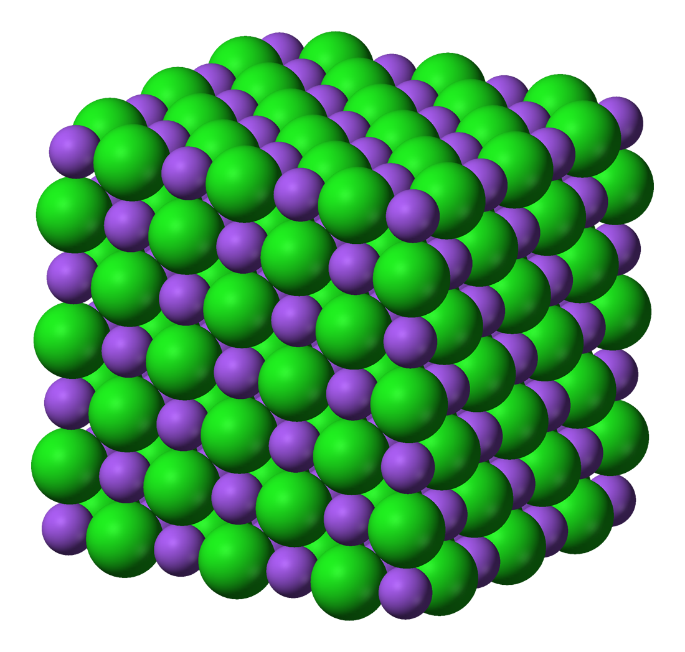
**Covalent/Molecular compounds** are bound tightly together in stable molecules. However these molecules are not very strongly attracted to other molecules in the material.
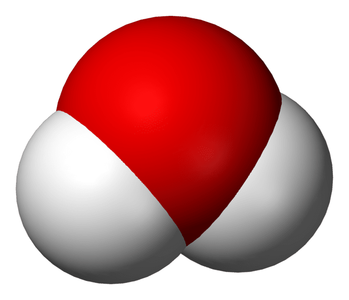
##### Conductivity
**Ionic compounds** conduct electricity when they dissolve in water. For example, if we take salt and dissolve it in water, the water molecules will pull the positive and negative ions apart. These ions will wander around the water instead of being close together. **Electricity** is movement of electrons through metals (or anything else). Electrons are negatively charged particles and the metals let the electrons wander around, conducting electricity. This makes the solution more conductive than water by itself. 

The reason ionic compounds by themselves are not conductive is because the ions are stuck in one place due to the compound's structure.

**Covalent compounds** are not conductive as electricity is conducted in water from the movement of ions from 1 place to another. Since there are no ions in molecular compounds, they don't conduct electricity.

##### Boiling/Melting Points

**Ionic compounds** have high melting & boiling points. This is because in order to break the positive and negative charges apart, it takes a huge amount of energy.

**Covalent compounds** have low meting points relative to ionic compounds as the molecules don't interact with each other very stringly making them very easy to pull apart.

##### Nature

**Ionic compounds** are very hard but very brittle. The positive and negative charges are held together by strong electrical attractive forces. These compounds are hard because they sinply do not move around much. This also explains the brittleness as they don't bend at all. It takes a lot of energy to pull ionic charges apart from each other.

If you take a hammer and strike a large crystal, you would end up using so much energy that the crystal doesn't break in one spot and instead shatters.

**Covalent compounds** are soft and squishy relative to ionic compounds as the molecules can move around easily because of the weak bonds between them. This makes them generally more flexible.

## Chemical Reactions & Writing Equations

### Definitions

**Chemical reactions** are a process in which substances interact, causing the formation of new substances with new properties.

**Reactants**: Starting materials in a reaction. They get used up.

**Products:** The new formed substances from a chemical reaction

**Law Of Conservation Of Mass:** In a chemical reaction, the mass of the reactants are equal to the mass of the products. (Eg. 40g of Calcium + 60g of Oxygen = 100g Calcium Oxide)

**Word Equations**: Equations which describe a chemical reaction using the reactants' and products' names. (Eg. Hydrogen Gas + Oxygen Gas -> Water)

**Chemical Equations:** Equations which describe a chemical reaction using chemical formulas. 
(Eg. H2 + O2 -> H2O)
**Note:** This is a skeleton equation, it does not follow the law of conservation of mass. 

### Writing Equations

In either type of equation, you would write it like so:
Reactant + Reactant -> Product + Product

Reactants are on the left, products are on the right.

Notice that instead of an equal sign, we use an arrow as the reactants and the products are not equal! This equation is represents a process.

#### Writing Word Equations
Write the element / compound names. If it's a gas, label it as a gas.
**Examples:**
Hydrogen gas + Oxygen gas -> Water
Aluminum + Oxygen Gas -> Aluminum Oxide

#### Writing Chemical Equations
**Note:** For this portion, I'll be using skeleton equations.
Write the element's symbols / compound formulas. You will also need to add the symbols of states as subscripts.

**States**
| State   | Symbol          | Example                      |
| ------- | --------------- | ---------------------------- |
| Solid   | (s)  | Al(s)             |
| Liquid  | (l)  | H2O(l) |
| Gas     | (g)  | H2(g)             |
| Aqueous | (aq) | CuSO4(aq)         |

Examples:
H2(g) + O2(g) -> H2O(l)
Als + O2(g) -> Al3O2(s)

### Law Of Conservation Of Mass

The law of conservation of mass essentially means that the mass of reactants are equal to the mass of the products.

In terms of atoms, the law states that atoms are not created or destroyed, they are just rearranged.

**Note:** It's important in a demonstration of conservation of mass that it's performed in a closed container. This is because if a gas is produced, it will leak and the mass would not appear as the equal.

### Classifying Chemical Reactions
There are 4 main types of chemical reactions with variations.
| Reaction              | Equation                                | Explanation                                                                                                                        | Example                                                            |
| --------------------- | --------------------------------------- | ---------------------------------------------------------------------------------------------------------------------------------- | ------------------------------------------------------------------ |
| Synthesis             | A + B -> AB                             | 2 elements combine to form a compound or 2 smaller compounds forming into a larger compound.                                       | 2Mg(s) + O2(g) -> 2MgO(s)                                        |
| Decomposition         | AB -> AB                                | A larger breaks down into 2 elements or 2 smaller compounds.                                                                       | 2H2O(l) -> 2H2(g) + O2(g)                  |
| Single Displacement   | A + BC -> BC + A                        | An element takes the place of another element in a compound.                                                                       | AlBr3(s) + 3K(s) -> 3KBr(s) + Al(s)                                 |
| Double Displacement   | AB + CD -> AD + CB                      | Elements in 2 different compounds switch places.                                                                                   | NaCl(s) + AgNO3(s) -> AgCl(s) + NaNO3(s)                 |
| Complete Combustion   | A + B -> CO2 + H2 | Takes place when large amounts of O2 is present and produces CO2 (Carbon Dioxide) and H2O (Water) | CH4(g) + O2(g) -> CO2(g) + 2H2O(l) |
| Incomplete Combustion | A + B -> CO + H2O            | Takes place when the amount of O2 is limited and produces CO (Carbon Monoxide) and H2O (Water)               | 4CH4(g) + 6O2(g) -> 4CO(g) + 8H2O(l)                                                                 |

As you can probably tell, each reaction has a different layout for reactions and products. This makes it easy to identify and even predict what kind of reaction reactants will create.

### Balancing Equations

**Skeleton equations** are equations where the number of atoms are not equal on both sides and therefore doesn't follow the law of conservation of mass. 

The point of balancing is to ensure the equation has the same amount of atoms on both sides and thus follows the law of conservation of mass.

In order to fix this, we **balance** the equations by adding coefficients (we cannot alter the subscripts).

In order to keep track of how many atoms/ions are on each side, we like to use a table.

| Atoms | Left Side | Right Side |
| ----- | --------- | ---------- |
|       |           |            |
|       |           |            |
|       |           |            |
|       |           |            |

Add coefficients as you see fit until you have the same amount of atoms on each side for each element.

## Acids & Bases

**Acids** are substances that release H (Hydrogen) ions when dissolved in water (forming an aqueous solution).

**Bases** are substances that release OH (Hydroxide) ions when dissolved in water (forming an aqueous solution).

**Properties:**
| Property | Acid                 | Base (Alkali)               |
| -------- | -------------------- | --------------------------- |
| Feel     | Wet                  | Slippery                    |
| Taste    | Sour                 | Bitter                      |
| Formula  | Begins with Hydrogen | Most contain hydroxide ions |
| Example  | Vinegar              | Baking Soda                 |

### Binary Acids

**Binary acids** contain 2 elements (one of which is Hydrogen).  It's made from a gas dissolved in water.

#### Naming

Starts with the prefix "hydro" and ends with the suffix "ic"

#### Examples

Hydrofluoric Acid (HF(aq))
Hydrosulphic Acid (H2S(aq))
Hydrobromic Acid (HBr(aq))

### Oxyacids

**Oxyacids** contain 3 elements (one of which is Hydrogen and Oxygen).

#### Naming
Drop the "ate" in the polyatomic ion and use the suffix "ic". Then add the word "acid" afterwards.

#### Examples
Nitric Acid (HNO3(aq))
Bromic Acid (HBrO3aq)
Phosphoric Acid (H3PO4(aq))

### Bases

**Bases** when reacting with acids will neutralize and yield salt and water.

Bases either contain OH (Hydroxide) or HCO3 (Bicarbonate) and behave like bases whether in a solution or not. Therefore, the aqueous symbol is not needed. 

#### Naming

There's no naming scheme for bases, just name them like normal :P

#### Examples

Zinc Hydroxide (Zn(OH)2)
Sodium Hydroxide (NaOH)

#### Neutralization

When a base and acid are mixed, they produce salt and water.

Base + acid -> Salt + water

### pH Scale

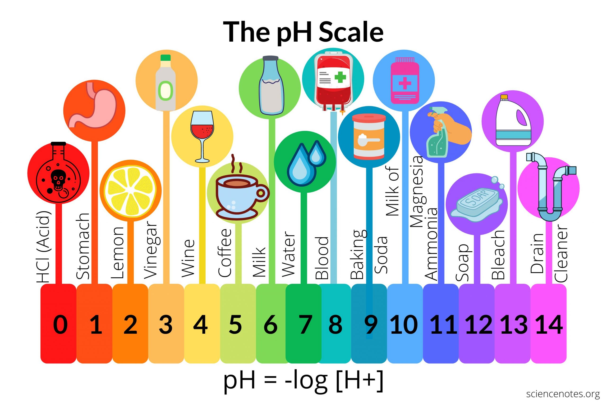

The pH scale is used as a measure of acidity to a solution.

It's ranged from 0 - 14 with 0 being the most acidic and 14 being the most basic. 7 is neutral. 

### Indicators

There are 4 main indicators to tell whether a compound is an acid or base and even the range it falls in on the pH scale.

These 4 are:
- Red Litmus Paper
- Blue Litmus Paper
- Bromothymol Blue
- Phenolphthalein

Here are it's reactions with acids and bases.

| Indicator         | Base       | Neutral    | Acid      |
| ----------------- | ---------- | ---------- | --------- |
| Red Litmus Paper  | Turns Blue | Stays Red  | Stays Red |
| Blue Litmus Paper | Stays Blue | Stays blue | Turns Red |
| Bromothymol Blue  | Stays Blue | Turns Green | Turns Yellow    |
| Phenolphthalein   | Turns Pink | Colorless  | Colorless |

**Phenolphthalein**
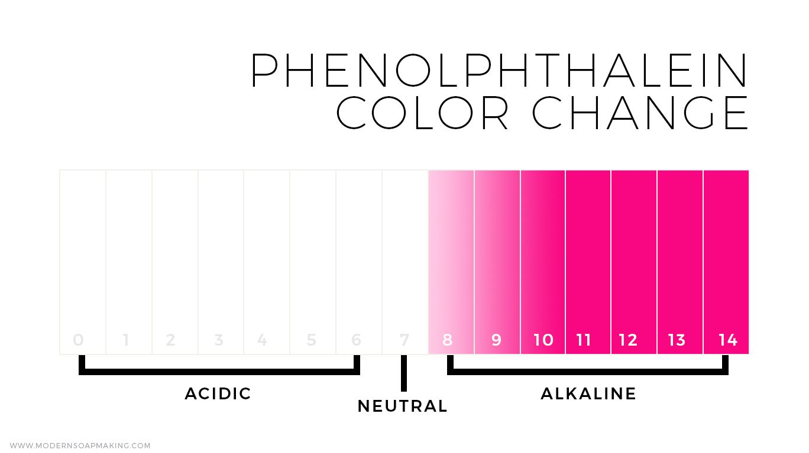
**Note:** Water turned a cloudy grey in my experience but I could've been doing something wrong `¯\_(ツ)_/¯`

**Bromothymol Blue**
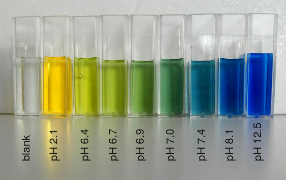
**NOTE:** In my experience, Bromothymol Blue does not turn green for neutral bases but who knows, maybe I was doing it wrong ``¯\_(ツ)_/¯``