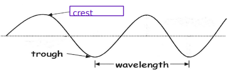
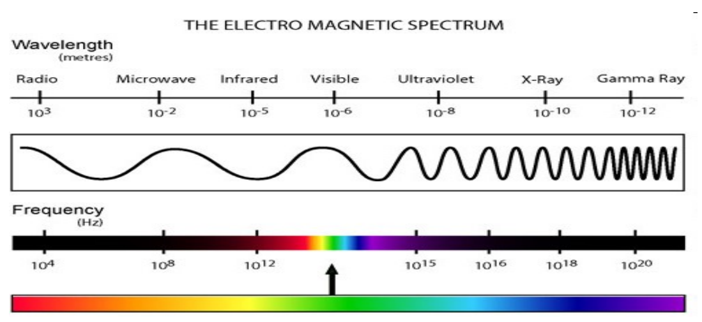

## Light

To put it simply, light is energy. 

It's a visible form of electromagnetic radiation. Light is energy transmitted in the form of a wave.

## Waves

### Characteristics Of Waves

The crest is the high point of a wave. Low points are called troughs. The distance of a crest/trough to another is a wavelength.

## Electromagnetic Spectrum

All EM waves are made of electrical energy & magnetic energy, do not need a medium to travel, travel at the speed of light.

Types of EM waves:
- Microwaves
- UV waves
- x-rays
- Radio waves
- Gamma rays
- Infrared

This graph shows the various types of electromagnetic radiation arranged by wavelength (distance from peak to peak/trough to trough) and frequency (number of peaks that pass a point in a certain timeline).

Longest waves are radio waves. Shortest are gamma waves.

High Frequency + Short Wavelength = High Energy

Low Frequency + Long Wavelength = Low Energy

This means gamma rays have the highest energy while radio waves have the lowest.

### Visible Regions of the Electro Magnetic Spectrum

In light, we can see **ROYGBIV**.

**ROYGBIV** is an acronym for Red, Orange, Yellow, Green, Blue, Indigo, Violet.

### Invisible Light

All waves shorter than visible light can cause cancer. Examples include UV & X-rays

Gamma rays are the most dangerous.

## Ray Model Of Light

Light travels in a straight line.

When you look at an object, you can see it because it travels in a straight line from the object to your eyes. We use an arrow to trace the path. This is called a **ray**. There can be an infinite amount of rays (example is a lit candle).

## Light Reflection

Reflection is when light bounces off a surface and changes direction as a result. 

## Light Absorbtion

Light can also be absorbed. Black ink absorbs all light and has your brain register it as a lack of light or black.

## Light Transmission

Light can also be transmitted. Transmission is when light penetrates an object & keeps travelling which allows you see object on the other side. Examples include glass.

There are 3 types of objects:

- Transparent - Light is transmitted without any change in direction.
- Translucent - Light can pass but is scattered in different directions. As a result, you can't see a clear image on the other side.
- Opaque - No light passes through. The light is instead absorbed or reflected.

## Light Refraction

Light rays can bend when travelling from one to another medium. Examples include prisms, corrective glasses, etc)

## How Light Is Produced

Light enters your eyes from everything you see. Objects can either produce or reflect light.

**Luminous** objects produce their own light. **Non-luminous** objects don't and can only be seen using reflected light.

### Types Of Light Production

| Type                       | How It Works                                                                                                            | Examples                                                    |
| -------------------------- | ----------------------------------------------------------------------------------------------------------------------- | ----------------------------------------------------------- |
| Incandescence              | Production of light from high temperatures                                                                              | Incandescent Lightbulb (Heated up tungsten), burning candle |
| Electric Discharge         | Passing an electric current through a gas (different noble gases produce different colors)                              | Neon lights, Streetlamps                                    |
| Fluorescence               | Immediate emission of visible light as a result of absorbtion of UV light                                               | Highlighters, Whitening Laundry Detergents                  |
| Phosphorescence            | Absorption of UV light resulting in emission of visible light over an extended period of time.                          | Glow In The Dark objects                                    |
| Chemiluminescence          | Production of light as a result of a chemical reaction. Little to no heat produced. Cyalume + Hydrogen Peroxide = Light | Glowsticks                                                  |
| LED (Light Emitting Diode) | Light produced as a result of a current flowing through semiconductors (1 direction)                                    | LED Lightbulbs                                                            |

## Mirrors

### Characteristics:
| Characteristics | Description            |
| --------------- | ---------------------- |
| Size            | Smaller or Larger      |
| Attitude        | Upright or upside down |
| Location        | Close or far           |
| Type            | Virtual or real                       |

